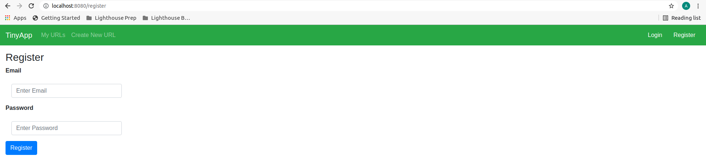
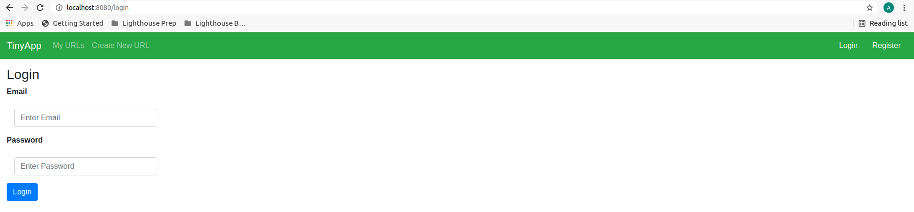
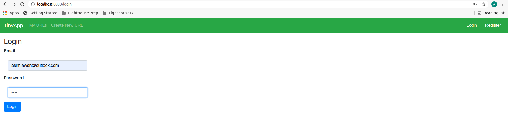
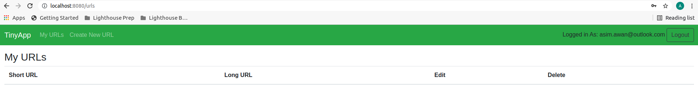
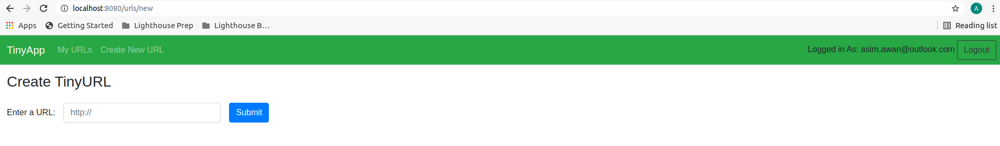
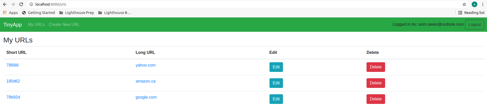
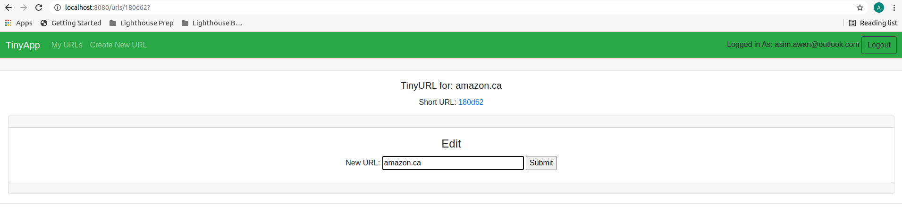

# TinyApp

## Project brief:

The TinyApp project is an application that creates short urls when the user enters an actual url.

This project is built using node and express server;

Dependencies include ejs, body-parser, cookie-session and bcrypt
Dev Dependencies include mocha, chai and nodemon

## Instructions:

Install all dependencies mentioned above
Run the server using npm start or node express_server.js
Type localhost:8080/ in your browser to launch the main webpage

## Screenshots:

